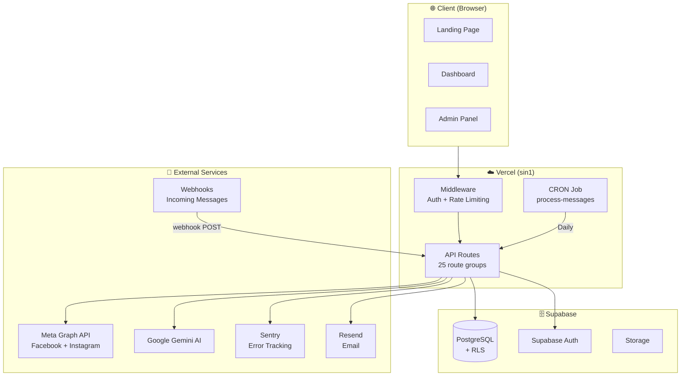
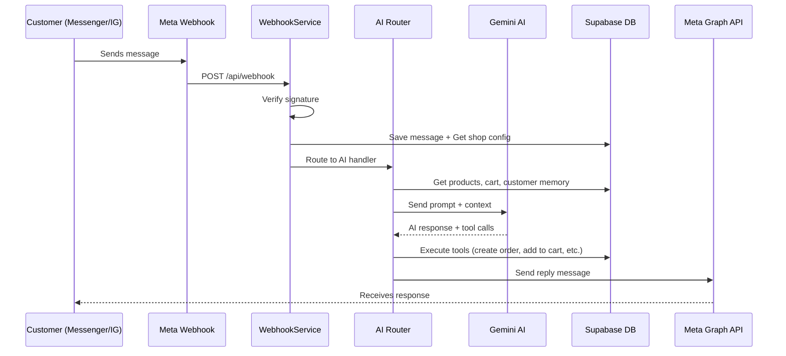

# 🏗️ Syncly Architecture Overview

> Syncly — AI-Powered Social Commerce Platform

## Tech Stack

| Layer | Technology | Version |
|-------|-----------|---------|
| Framework | Next.js (App Router) | 16.1.1 |
| UI | React | 19.2.3 |
| Language | TypeScript | 5.x |
| Styling | Tailwind CSS | 4.x |
| Database | Supabase (PostgreSQL) | - |
| ORM | Drizzle ORM | 0.45.1 |
| Auth | Supabase Auth | 0.8.0 |
| AI | Google Generative AI + AI SDK | 0.24.1 / 6.0.33 |
| Monitoring | Sentry | 10.34.0 |
| Deployment | Vercel (sin1 region) | - |
| Email | Resend | 6.7.0 |
| Push | Web Push (VAPID) | 3.6.7 |
| Testing | Vitest + Playwright | 4.0.17 / 1.58.0 |
| Validation | Zod | 4.3.5 |

## Architecture Diagram



## Data Flow: Message → AI Response



## Module Map

```
src/
├── app/                    # Next.js App Router
│   ├── api/                # 25 API route groups
│   │   ├── webhook/        # Facebook/IG webhook handler
│   │   ├── facebook/       # FB connection APIs
│   │   ├── meta/           # Meta data deletion
│   │   ├── chat/           # AI chat endpoint
│   │   ├── admin/          # Admin panel APIs
│   │   ├── dashboard/      # Dashboard data APIs
│   │   ├── orders/         # Order management
│   │   ├── cart/           # Shopping cart
│   │   ├── payment/        # Payment (QPay + webhook)
│   │   ├── subscription/   # Plan management
│   │   ├── cron/           # Scheduled jobs
│   │   └── health/         # Health check
│   ├── dashboard/          # Dashboard pages (products, orders, customers, inbox)
│   ├── admin/              # Super admin panel
│   └── auth/               # Login, Register, OAuth callback
│
├── lib/                    # Core business logic
│   ├── ai/                 # AI module (Router, Providers, Tools, Handlers)
│   ├── facebook/           # Meta Graph API (messenger.ts)
│   ├── webhook/            # WebhookService + RetryService
│   ├── services/           # CartService, OrderService, ProductService
│   ├── auth/               # Clerk auth helpers
│   ├── payment/            # Payment processing
│   ├── invoice/            # Invoice generation
│   ├── email/              # Resend email
│   ├── monitoring/         # Sentry helpers
│   ├── validations/        # Zod schemas
│   ├── utils/              # Rate limiter, helpers
│   └── supabase*.ts        # 4 Supabase clients (browser, server, middleware, base)
│
├── components/             # React components
│   ├── ui/                 # Base UI components
│   ├── chat/               # Chat/inbox components
│   ├── dashboard/          # Dashboard widgets
│   ├── cart/               # Cart components
│   └── onboarding/         # Setup wizard
│
├── middleware.ts            # Auth + Rate limiting middleware
├── contexts/               # React contexts (Auth)
├── hooks/                  # Custom React hooks
└── types/                  # TypeScript type definitions
```

## Key Configuration Files

| File | Purpose |
|------|---------|
| `next.config.ts` | Security headers, image domains, bundle analyzer |
| `vercel.json` | Deployment config, CRON schedule, region |
| `sentry.*.config.ts` | Error tracking (client, server, edge) |
| `middleware.ts` | Route protection, rate limiting |
| `vitest.config.ts` | Unit test configuration |
| `playwright.config.ts` | E2E test configuration |

## Security Architecture

- **Middleware**: Auth check on protected routes, rate limiting (strict/standard/webhook)
- **Security Headers**: X-Frame-Options DENY, X-Content-Type-Options, Referrer-Policy, XSS Protection, Permissions-Policy
- **Supabase RLS**: Row-level security on all tables
- **Webhook**: Facebook signature verification
- **API**: Zod input validation
